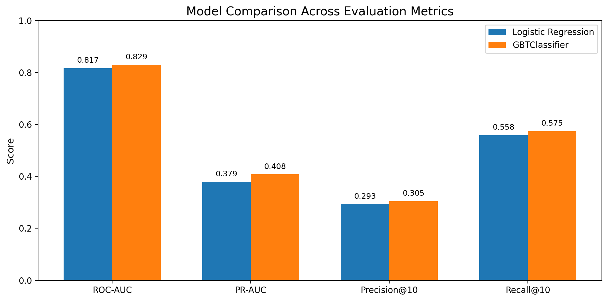
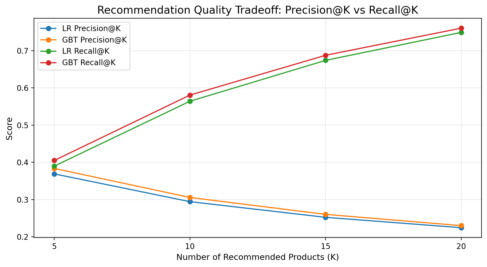
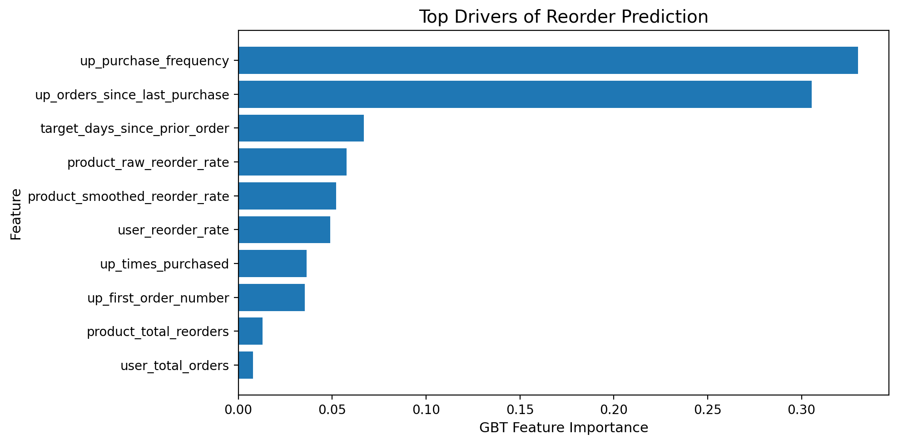
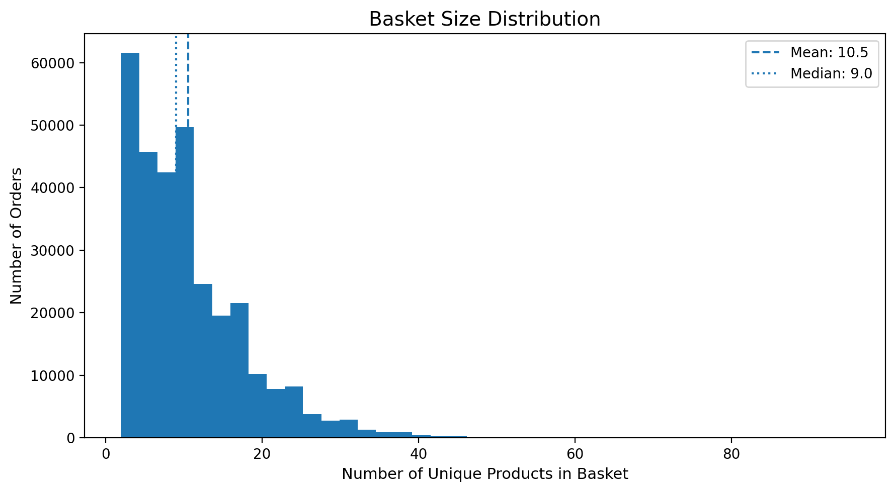
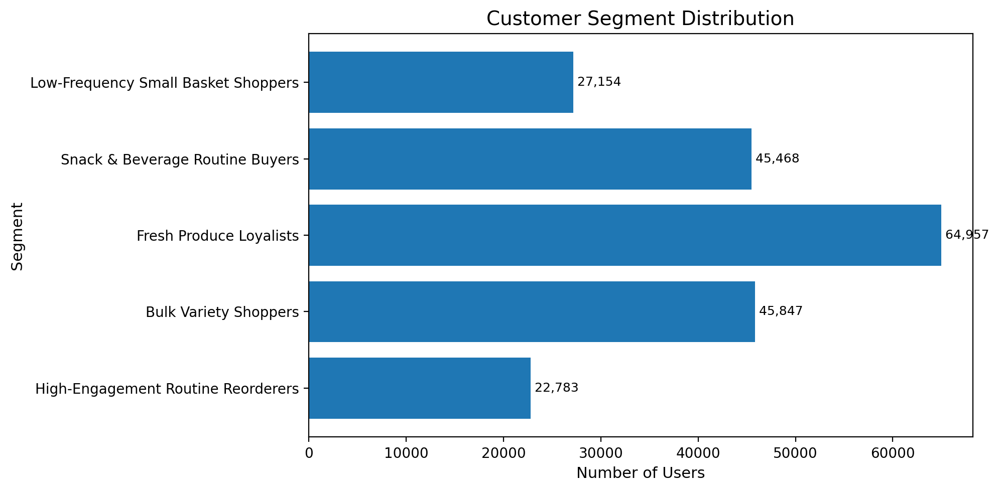
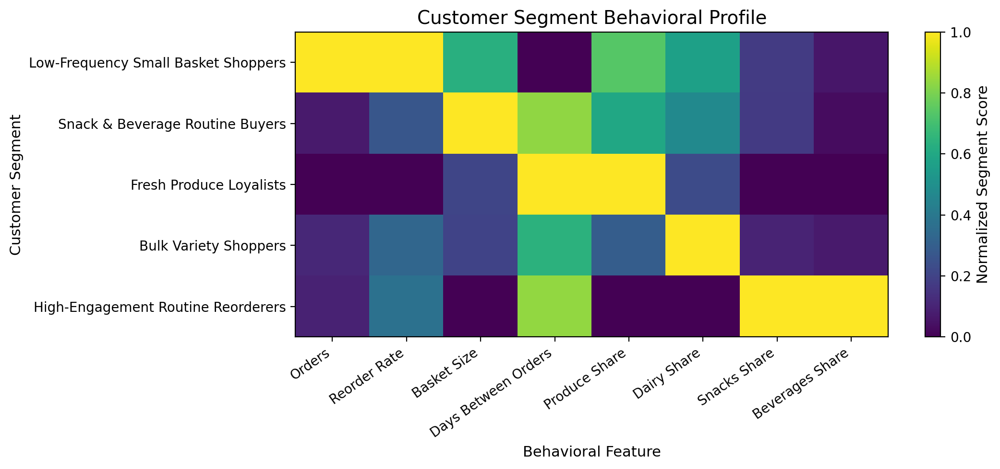

# Instacart Reorder Recommendation Engine

A scalable end-to-end recommendation system built using PySpark and Databricks to predict next-basket purchases, generate cross-sell recommendations, and segment customers for targeted business strategies.

---

## Problem Statement

In online grocery platforms, a large portion of purchases are repeat orders. The goal of this project is to:

- Predict which products a user will reorder in their next basket
- Recommend complementary products using basket-level patterns
- Segment users based on behavioral patterns for targeted strategies

---

## Dataset

Instacart Online Grocery Dataset  
- 3+ million orders  
- 30+ million order-product interactions  
- ~200K users  
- 50K+ products  

---

## Solution Overview

This project builds a complete recommendation pipeline with three components:

### 1. Reorder Prediction Model
Predicts which previously purchased products a user is likely to reorder.

### 2. Basket Recommendation (FP-Growth)
Finds frequently co-purchased products for cross-sell recommendations.

### 3. Customer Segmentation
Clusters users based on behavior to enable personalized strategies.

---

## Tech Stack

- PySpark (Spark ML)
- Databricks (Distributed processing)
- Python (Pandas, NumPy)
- Matplotlib (Visualization)

---

## Pipeline Architecture

1. Data Ingestion → CSV to optimized Parquet
2. Data Quality & EDA
3. Feature Engineering (user, product, user-product, temporal)
4. Model Training (Logistic Regression + GBT)
5. Basket Analysis (FP-Growth)
6. Customer Segmentation (K-Means / Rule-based)
7. Visualization & Business Insights

---

## Model Performance

| Model | ROC-AUC | PR-AUC | Precision@10 | Recall@10 |
|------|--------|-------|-------------|----------|
| Logistic Regression | 0.819 | 0.381 | 0.294 | 0.564 |
| GBTClassifier | 0.830 | 0.409 | 0.306 | 0.581 |

### Key Insight
- PR-AUC baseline ≈ class imbalance (~10%)
- Achieved ~4x lift over random performance

---

## Model Comparison



---

## Recommendation Quality



**Interpretation:**
- ~3 out of top 10 recommended products are actually reordered
- Model captures ~58% of actual reorders

---

## Feature Importance



### Key Drivers
- Purchase frequency (user-product)
- Recency (time since last purchase)
- Product reorder rate
- User reorder tendency

---

## Basket Insights



### Observations
- Grocery baskets show strong repeat patterns
- Moderate basket sizes dominate → ideal for recommendation ranking

---

## Customer Segments





### Segments Identified

- Low-Frequency Small Basket Shoppers
- Snack & Beverage Routine Buyers
- Fresh Produce Loyalists
- Bulk Variety Shoppers
- High-Engagement Routine Reorderers

---

## Business Impact

### Reorder Model
- Personalized product ranking
- Improves retention and reorder frequency

### FP-Growth
- Cross-sell recommendations at checkout
- Bundle creation opportunities

### Segmentation
- Targeted marketing strategies
- Improved customer lifetime value

---

## Key Learnings

- Importance of leakage-free feature engineering
- PR-AUC vs ROC-AUC in imbalanced problems
- Precision@K is critical for recommendation systems
- User-product interactions dominate predictive power
- Scalability challenges in real-world ML pipelines

---

## Project Structure

```text
notebooks/
  01_ingest_and_optimize.ipynb
  02_data_quality_and_eda.ipynb
  03_feature_engineering.ipynb
  04_reorder_prediction_model.ipynb
  05_basket_recommendations_fpgrowth.ipynb
  06_customer_segments_and_business_insights.ipynb
  07_visuals_and_exports.ipynb

images/
  *.png
